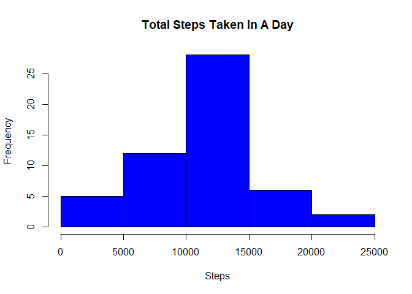
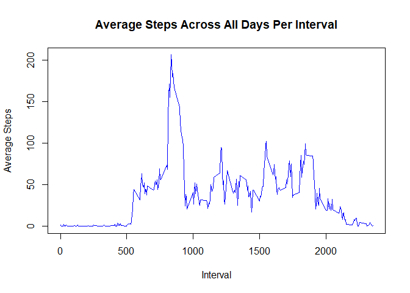
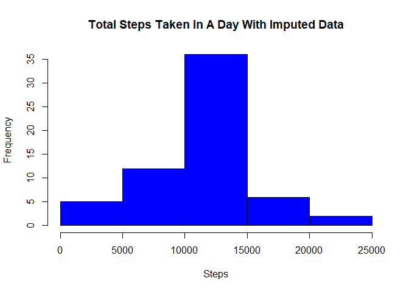
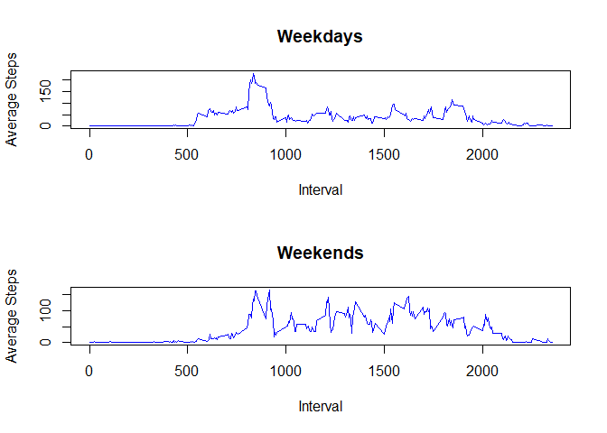

## Loading and preprocessing the data

First we must unzip the file with the data and read from it. Knowing that some
data is missing, we shall also tidy the data so there are no missing values 
when we start analyzing the data.


```r
unzip("activity.zip")
data <- read.csv("activity.csv")
clean_data <- data[complete.cases(data) == TRUE,]
```


## What is mean total number of steps taken per day?

Here, we will first create a histogram of the total steps taken in a day, 
after which we will calculate the mean. Since the data is given in 5-minute
intervals, first we must aggregate the steps in all those intervals in a day
and then create the histogram.


```r
total_steps <- aggregate(steps ~ date, data = clean_data, FUN = sum)
hist(total_steps$steps,
     main = "Total Steps Taken In A Day", 
     xlab = "Steps",
     col = "blue")
```

<!-- -->

```r
mean_steps <- mean(total_steps$steps)
median_steps <- median(total_steps$steps)
```

The mean number of steps taken in a day is 1.0766189\times 10^{4} and the median
number of steps is 10765.


## What is the average daily activity pattern?

Now we need to create a time series graph of the 5-minute intervals on the
x-axis and the average steps taken in that interval across all days on the
y-axis. Again, we will aggregate the data, but this time it'll be according
to the interval rather than the day.


```r
average_steps <- aggregate(steps ~ interval, data = clean_data, FUN = mean)
plot(average_steps$interval, 
     average_steps$steps, 
     type = "l", 
     main = "Average Steps Across All Days Per Interval", 
     xlab = "Interval", 
     ylab = "Average Steps",
     col = "blue")
```

<!-- -->

```r
max_steps <- average_steps[which.max(average_steps$steps),1]
```

If we had to calculate the number of steps in the interval with the maximum
number of steps we would have to aggregate the data again but slightly differently.
Since we only want the interval, the one with the highest average will also have
the maximum number of steps since the amount of data we have on steps for each
interval is the same.

Hence, the interval which has the maximum steps is 835.

## Imputing missing values

Here we will work with the original set of data that has some values missing.


```r
missing_val <- nrow(data[is.na(data),])
```

The number of rows with missing values is `{r missing_val}`

We must now fill in the missing values. We'll do so by calculating the mean
number of steps for each interval and use that calculation to fill in the
missing values. This would be a good way to fill missing values because barring
unforeseen circumstances on any given day, on average the steps taken at specific 
intervals will remain consistent.


```r
new_dat <- data
## Helper that extracts the average steps for a given interval
## Assumes the arguments given to the function are valid
reassign <- function(df,interval) {
        df[df$interval == interval,2]
}
NAs <- which(is.na(new_dat$steps))
for(v in NAs) {
        new_dat$steps[v] <- reassign(average_steps,new_dat$interval[v])
}
imp <- aggregate(steps ~ date,data = new_dat, FUN = sum)
hist(imp$steps,
     main = "Total Steps Taken In A Day With Imputed Data",
     xlab = "Steps",
     col = "blue")
```

<!-- -->

```r
imp_mean <- mean(imp$steps)
imp_median <- median(imp$steps)
```

The mean steps in a day is now 1.0766189\times 10^{4} and the median is 1.0766189\times 10^{4}.
Imputing the missing data has no impact on the average total steps taken daily but the
median does increase slightly.

## Are there differences in activity patterns between weekdays and weekends?

Using the data with imputed values, we first create a factor variable to
differentiate between weekdays and weekends


```r
new_dat["day"] = weekdays(as.Date(new_dat$date))
new_dat$day[new_dat$day %in% c("Saturday","Sunday")] <- "weekend"
new_dat$day[new_dat$day != "weekend"] <- "weekday"
new_dat$day <- as.factor(new_dat$day)
imp_steps <- aggregate(steps ~ interval + day, data = new_dat, FUN = mean)
wday <- imp_steps[imp_steps$day == "weekday",]
wend <- imp_steps[imp_steps$day == "weekend",]
par(mfrow = c(2,1))
plot(wday$interval,
     wday$steps,
     type = "l",
     main = "Weekdays",
     xlab = "Interval",
     ylab = "Average Steps",
     col = "blue")
plot(wend$interval,
     wend$steps,
     type = "l",
     main = "Weekends",
     xlab = "Interval",
     ylab = "Average Steps",
     col = "blue")
```

<!-- -->
